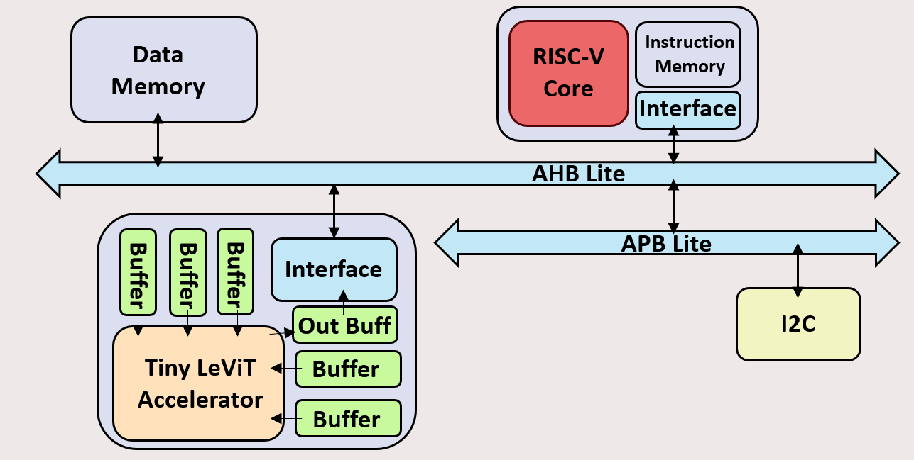

# Tiny_SoC
This is my hobby project. After I study [RSIC-V CPU](https://github.com/BoChen-Ye/RISC-V-five-stage-CPU) and [AI accelerator](https://github.com/BoChen-Ye/Tiny_LeViT_Hardware_Accelerator), I wonder how to connect them with bus, so I make this **Tiny_SoC** project.

This is not a serious project, so it must be very simple and have many problems. I finish this project with **ChatGPT** which help me a lot.

Anyway, this project is only for study and understanding SoC.

## File Structure
- `figure` : the figure of project.
- `instruction` : contain a python file which can translate RSIC-V instruction to binary code for core excution.
- `sim` : the testbench for simulation.
- `src` : the RTL file of design.

## Architecture
This Tiny_project architecture is all finished by myself. The main part is a RSIC-V CPU and Tiny_LeViT accelerator that I made before.
I use AHB-Lite bus connect core, memory and accelerator. ALL architecture you can see in figure below.
- APB is not add until Now.
- I2C is not add until Now.
- The Wrapper is only for Conv4 core, I will extend to whole LeViT accelerator.

## RSIC-V instruction
- This CPU can excute 13 instructions (`sw,lw,add,sub,and,or,slt,addi,ori,slti,beq,jal,lui`).
- You can use `instruction/Rsicv2bin.py` to get `.txt` binary file and add it to simulation.

## SoC Address
- 32'd0100_0000: RAM, data meomry.
- 32'd1000_0000: Tiny_LeViT Accelerator.

## Future Plan
- Finish whole accelerator warpper.
- Add APB and I2C.
- Add DMA.
- Improve RSIC-V core.
- Add Interrupt control module.
- Add peripheral device: SPI, UART, GPIO, Timer.

## SoC Study Resource
- Book:
[System on Chip (SOC) Architecture: A Practical Approach](https://link.springer.com/book/10.1007/978-3-031-36242-2)
[A Practical Approach to VLSI System on Chip (SoC) Design: A Comprehensive Guide](https://link.springer.com/book/10.1007/978-3-030-23049-4)

- Course:
[一生一芯ysyx](https://ysyx.oscc.cc/)
[SoC 101](https://www.youtube.com/playlist?list=PLZU5hLL_713ygweO3b_9KiZUJuEI7I5yK)